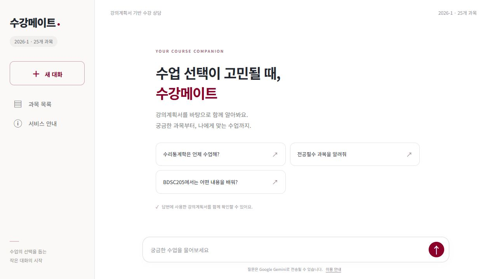
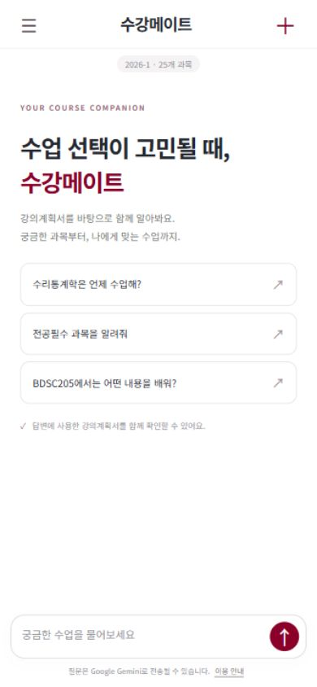

# 수강메이트 · Sugang Mate

**강의계획서에서 과목을 찾고 비교하며, 답변의 근거까지 확인하는 수강 상담 서비스입니다.**

수강 계획을 세울 때 흩어진 강의계획서의 평가방식·수업 내용·시간표를 반복해서 대조하는 문제에서 출발했습니다. 과목 메타데이터 조회와 문서 검색을 질문에 맞게 연결하고, “그중 전공필수는?” 같은 후속 질문까지 처리합니다.

[](https://github.com/JunH14/sugang-mate/actions/workflows/checks.yml)

`Python 3.11 / 3.12` · `Gradio` · `BM25` · `Chroma` · `Gemini`

**[공개 데모 열기 ↗](https://sugang-mate.onrender.com)** · [3분 시연 가이드](docs/demo.md) · [문서 모아보기](docs/README.md)

무료 서버가 쉬고 있으면 첫 접속에 약 1분이 걸릴 수 있습니다.

**실제 과목 25개로 공개 데모를 운영합니다.** 2026학년도 1학기 수집 자료를 사용하며 최신 개설 정보는 아닙니다. 방문자는 설치·API 키·학교 로그인 없이 체험할 수 있고, 개발자의 PC가 꺼져 있어도 Render 서버에서 실행됩니다.

## 이렇게 사용합니다

1. **찾기** — “전공필수 과목을 알려줘”: 전체 과목에서 조건에 맞는 목록을 조회합니다.
2. **비교하기** — “BDSC201과 BDSC203의 평가방식을 비교해줘”: 두 과목의 내용을 근거와 함께 확인합니다.
3. **이어 묻기** — “그중 전공필수는 몇 개야?”: 방금 비교한 과목 안에서 BDSC201 한 과목을 찾습니다.

<p align="center">
  
</p>
<details>
<summary>모바일 첫 화면 보기</summary>
<p align="center">
  
</p>
</details>

답변마다 근거를 펼쳐 확인하고, 화면 아래 입력창에서 질문을 이어갈 수 있습니다. 새 대화·과목 목록·서비스 안내는 별도 메뉴로 모았습니다.

서버는 연락처·로컬 경로를 제외한 실제 자료를 비밀 파일로 읽으며 GitHub에는 원문을 넣지 않습니다. 저장소를 내려받아 실행하는 **로컬 데모는 가상 과목 6개**를 사용하고 API 키가 필요 없습니다.

## 왜 이렇게 설계했나요?

- **목록·개수는 직접 계산합니다.** 검색 상위 몇 개를 전체 과목으로 오해하지 않도록 시간표·이수구분 조회와 본문 검색을 나눴습니다.
- **후속 질문은 대화 안에서 해석합니다.** 직전 과목 집합에 조건을 적용하고, 대화 맥락을 캐시에 반영해 다른 대화의 결과가 섞이지 않게 했습니다.
- **답변마다 근거를 연결합니다.** 사용한 과목과 원문 발췌를 해당 답변에서 펼쳐 확인합니다. 데이터·모델 정보가 맞지 않는 벡터 인덱스는 사용하지 않습니다.

수집 → 형식별 추출 → 중복 정제 → 조회·검색 → 답변·출처 표시로 이어집니다. 구현 위치와 선택의 근거는 [설계 결정](docs/decisions.md)에 정리했습니다.

## 무엇을 검증했나요?

| 검증 | 확인된 결과 |
|---|---|
| 자동 테스트 | 설정·캐시·대화 격리·공개 요청 제한·화면 등 **115개 통과**: [검사 기록](evaluation/release-checks.json) |
| 실제 과목의 기존 질문 회귀 검사 | API와 답변 캐시를 끄고 **원본·서버용 정제본 각각 103/103개 조건 통과** |
| 이전 Gemini 진단 | 가상·실제 과목 **16개 흐름 확인**, 생성 답변 **12개**의 원문 근거 대조 |
| 실제 25개 공개 서버 | 로그인·방문자 API 키 없이 **3개 흐름 통과**, 재시작 후 동일 자료 유지: [확인 기록](evaluation/hosted-deployment-checks.json) |
| 검색 방식 진단 | 30문항의 근거 포함 과목 Recall@5 chunks: 고정 길이 **50.0%**, 구역별 **33.3%** |

공개 서버는 BM25·Gemini로 실행하며, 이전 실제 자료의 Chroma 검증은 별도 환경의 기록입니다. 기능 회귀·소수 API 질문·외부 접속 확인을 독립적인 정확도 점수로 해석하지 않습니다. [실제 API 검증](docs/live-api-validation.md) · [전체 평가 보고서](docs/evaluation.md)

## 내 컴퓨터에서 실행하기

Python 3.11 또는 3.12에서 저장소를 내려받고 가상환경을 만듭니다.

```text
git clone https://github.com/JunH14/sugang-mate.git
cd sugang-mate
python -m venv .venv
```

**Windows PowerShell**

```powershell
.\.venv\Scripts\python.exe -m pip install -r requirements.txt
.\.venv\Scripts\python.exe run_demo.py
```

**macOS / Linux**

```bash
.venv/bin/python -m pip install -r requirements.txt
.venv/bin/python run_demo.py
```

[localhost:7861](http://127.0.0.1:7861)을 열면 됩니다. 종료는 실행 창에서 `Ctrl+C`입니다. [Gemini 온라인 실행·배포](docs/deployment.md)와 [실제 데이터·평가 재현](docs/running.md)도 제공합니다.

## 더 살펴보기

2026학년도 1학기 강의계획서를 다룬 기말 프로젝트를 바탕으로, 재현 가능한 실행 환경과 데이터 품질·기능·검색 검증을 보완했습니다. 학교 원문·API 키·사용자 대화는 공개 파일에서 제외했습니다.

프로젝트 배경부터 설계, 실험 기록까지 **[문서 모아보기 →](docs/README.md)** 에서 관심 있는 부분을 선택할 수 있습니다.
