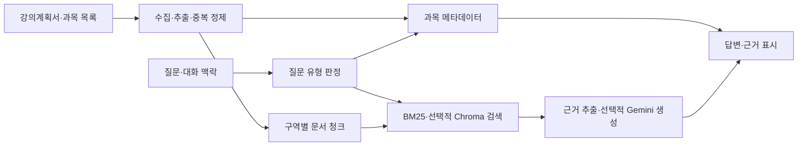

# 수강메이트 문서

[프로젝트 첫 화면으로](../README.md)

처음 보는 분은 **시연 → 설계 결정 → 평가 보고서** 순서로 읽으면 구현과 검증 범위를 빠르게 확인할 수 있습니다.

## 사용하기

- **[3분 시연](demo.md)** — 과목 비교, 후속 질문, 전체 목록 조회의 입력과 예상 결과입니다.
- **[실행 안내](running.md)** — API 키 없는 실행, 실제 데이터·Gemini·Chroma 연결, 테스트와 보고서 재현 방법입니다.
- **[온라인 실행·배포](deployment.md)** — 공개 데모 구성, 서버 설정과 요청 제한입니다.
- **[프로젝트 소개](portfolio.md)** — 해결하려는 문제, 구현 범위, 포트폴리오 설명입니다.

공개 서버를 2026학년도 1학기 수집 자료 25개로 전환하고 있으며, 개발자 PC 밖의 접속 검사는 확인 단계입니다. 방문자는 설치·API 키·학교 로그인 없이 사용할 수 있습니다. 로컬 `run_demo.py`는 가상 과목 6개로 동작합니다. 주소와 최신 상태는 [프로젝트 첫 화면](../README.md)에 안내합니다.

## 설계 이해하기

- **[설계 결정](decisions.md)** — 구조화 조회와 검색을 나눈 이유, 대화 맥락·캐시 처리, 벡터 인덱스 검증, 발견한 오류와 수정 과정입니다.
- **[데이터 품질](data-quality.md)** — 26개 분반 레코드를 25개 문서로 정제하면서 시간표를 보존한 과정과 결측·첨부파일 품질 감사입니다.
- **[공개 서버 데이터](../data/README.md)** — 원본 보존, 연락처·경로 정제, 서버 비밀 파일과 해시 검사입니다.
- **[참고 자료](references.md)** — 저장소 구성과 기술 검토에 참고한 자료입니다.

핵심 흐름은 다음과 같습니다.

## 검증 확인하기

- **[평가 보고서](evaluation.md)** — 현재 기능 검사, 과거 개선 기록 감사, 신규 검색 진단을 구분한 결과와 한계입니다.
- **[실제 API 검증](live-api-validation.md)** — SDK 요청 계측과 원문 대조 결과입니다.
- **[GitHub 자동 검사](https://github.com/JunH14/sugang-mate/actions/workflows/checks.yml)** — 운영체제·Python 버전별 최신 실행 상태입니다.
- **[공개 서버 외부 검사](https://github.com/JunH14/sugang-mate/actions/workflows/hosted-demo.yml)** — GitHub의 별도 실행 환경에서 API 키 없이 실제 과목을 조회하는 수동 검사입니다. 전환 후 결과는 확인 중입니다.
- **[사용자 검증 계획](user-study.md)** — 향후 학생 대상 사용성 평가 절차입니다. 아직 수행한 실험은 아닙니다.

현재 자동 테스트 수와 코드 해시는 [최신 검사 기록](../evaluation/release-checks.json)을 기준으로 합니다. 이전 기록의 오프라인 기능 회귀 **103/103개**, 실제 API **16개 흐름**과 생성 답변 12개의 원문 대조는 당시 데이터·실행 환경의 결과입니다. 공개 서버의 BM25·Gemini 실행과 로컬 Chroma 검증을 구분합니다. 검색 진단 30문항의 결과 역시 실사용 효과나 독립적인 답변 정확도를 뜻하지 않습니다.

원시 집계와 재현 파일 보기

- [로컬 검사 기록](../evaluation/release-checks.json): 실행 환경, 결과, 코드 해시
- [기능 회귀 집계](../evaluation/release-regression.json): 질문·코드 해시와 응답 모드별 결과
- [실제 API 집계](../evaluation/live-api-checks.json): 호출·응답·출처 대조와 실행 조건
- [서버용 데이터 검사](../evaluation/hosted-data-checks.json): 정제·보존 검사, 문서 수와 파일 해시
- [검색 진단 질문](../evaluation/retrieval_cases.json) · [검색 진단 결과](../evaluation/retrieval-results.json): 문항별 라벨·측정값
- [과거 기록 감사](../evaluation/legacy-audit.json): 기존 실험의 동일 조건 여부와 재집계
- [자동 테스트 코드](../tests/): 공개 예시로 재현하는 기능 검사

학교 원문·정제 본문·벡터 DB는 GitHub에 넣지 않습니다. 서버용으로 준비한 자료는 Render 비밀 파일로 읽고 답변에 필요한 발췌만 화면에 표시합니다. 공개 저장소만으로 재현하는 범위와 실제 코퍼스가 필요한 검사는 [평가 보고서](evaluation.md) 및 [실행 안내](running.md)에 구분했습니다.
