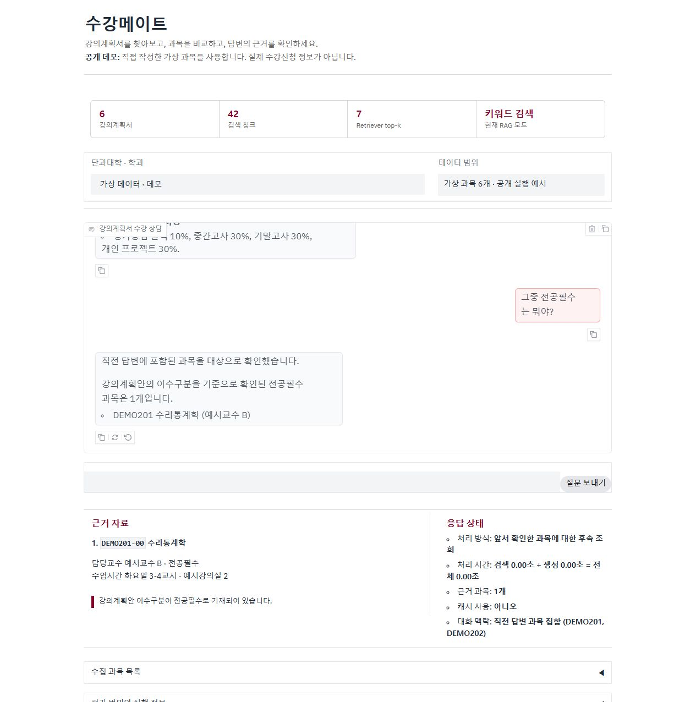

# 3분 시연 가이드

[공개 데모](https://sugang-mate.onrender.com)는 실제 과목 25개로 운영한다. 설치·API 키·학교 로그인은 필요 없다. 개발자의 PC와 독립된 서버에서 실행하며, 무료 서버의 첫 기동에는 약 1분이 걸릴 수 있다.

## 화면 사용법

- 첫 화면의 예시 질문을 선택하거나 화면 아래 입력창에 직접 질문한다. 답변을 읽고 같은 입력창에서 질문을 이어간다.
- 각 답변에 붙은 근거를 펼쳐 과목·관련 문장·원문 링크를 확인한다. 이전 답변의 근거도 해당 답변에서 다시 볼 수 있다.
- 새 주제로 바꿀 때는 메뉴에서 새 대화를 시작한다. 과목 목록과 서비스 설명도 메뉴에서 확인할 수 있다.

[PC·모바일 첫 화면](../README.md#이렇게-사용합니다)은 실제 실행 화면을 캡처한 이미지다. 과목 본문이나 개인 질문이 없는 시작 화면을 사용한다.

새 대화 화면의 PC·모바일 배치와 동작 확인은 [UI 검사 기록](../evaluation/chat-ui-checks.json)에 별도로 기록한다.

## 공개 서버: 실제 과목으로 확인

2026학년도 1학기 수집 자료 기준이다. 현재 학기의 개설 정보가 아니며, 시연 전 화면의 데이터 범위를 확인한다.

1. `BDSC201과 BDSC203의 평가방식을 비교해줘`를 입력한다. 두 과목의 평가 내용과 출처를 확인한다.
2. 같은 대화에서 `그중 전공필수는 몇 개야?`를 입력한다. 직전 두 과목 중 **BDSC201 한 과목**이 예상 결과다.
3. 새 대화를 시작하고 `전공필수 과목을 알려줘`를 입력한다. 전체 데이터의 **BDSC155·BDSC201·BDSC205**를 확인한다.

이전 공개본에서 비교·후속 질문과 대화 초기화를 확인했다. 생성 답변의 표현은 달라질 수 있으므로 과목 집합과 근거 본문을 중심으로 확인한다. 당시 서버 재시작 후 [GitHub의 독립 접속 검사](https://github.com/JunH14/sugang-mate/actions/runs/34437384036)에서도 로그인·API 키 없이 근거 질문·시간표·범위 밖 안내 3개가 모두 통과했다. 이 기록과 새 화면의 사용성 확인은 구분한다. [데이터 준비·배포 안내](deployment.md)

## 로컬 데모: 가상 과목으로 재현

`python run_demo.py`는 항상 가상 과목 6개를 사용하며 API를 호출하지 않는다. 아래는 저장소만 내려받아 따라 할 수 있는 시나리오다.

### 과목 비교 → 후속 질문

1. `DEMO201과 DEMO202의 평가방식을 비교해줘`를 입력한다.
2. 수리통계학·머신러닝의 평가방식과 두 과목의 출처를 확인한다.
3. 같은 대화에서 `그중 전공필수는 뭐야?`를 입력한다.
4. 직전에 비교한 과목 중 전공필수인 **DEMO201 수리통계학 한 과목**이 나오는지 확인한다.

이전 가상 데이터 화면의 후속 질문 예시

이 시나리오는 본문 비교와 대화 맥락 안의 필터링을 연결한다. 공개본 검토 중 후속 질문에 두 과목 모두가 반환되는 문제를 발견해, 직전 과목 집합에 이수구분을 먼저 적용하도록 수정하고 회귀 테스트를 추가했다.

### 전체 목록 조회

추가로 비교 직후 `그중 프로젝트가 있는 과목은 몇 개야?`를 물으면 개인 프로젝트가 있는 DEMO202 한 과목, `그중 PBL 과목은 몇 개야?`는 0개가 나온다. 조건을 적용한 뒤 개수를 계산하는지 확인하는 사례다.

새 대화를 시작하고 `전공필수 과목을 알려줘`를 입력한다.

예상 과목은 **DEMO101 데이터분석입문**, **DEMO201 수리통계학**이다. 앞 단계의 한 과목 결과와 비교하면 전체 데이터 조회와 대화 안의 조회가 어떻게 다른지 확인할 수 있다.

### 다른 조회와 데이터 범위 확인

각 질문은 새 대화에서 실행한다.

| 질문 | 확인할 결과 |
|---|---|
| `PBL 과목을 알려줘` | DEMO301 데이터시각화PBL |
| `월요일 수업을 알려줘` | DEMO101·DEMO401 |
| `천체물리학 실험 수업이 있어?` | 해당 과목 출처가 없는 응답 |

## 구현 확인

- 대화 집합 필터링: [app.py](../app.py)의 `build_contextual_course_set_answer`
- 샘플 기능 및 후속 질문 검사: [test_demo.py](../tests/test_demo.py)
- 서로 다른 대화의 캐시 격리: [test_core.py](../tests/test_core.py)
- 별도 서버 없이 공개 시나리오 확인: `python scripts/verify_release.py`

위 시연은 구현 동작 확인이며 실제 학생의 사용성·시간 절감 효과를 측정한 실험은 아니다.

[기존 API 검증 기록](live-api-validation.md)은 가상·실제 데이터에서 당시 별도로 수행한 진단이며, 위 공개 서버 전환의 외부 검사 결과와 구분한다.
