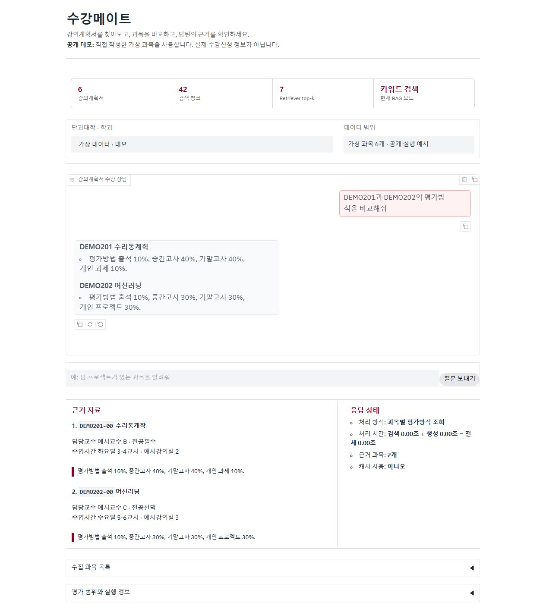

# 수강메이트 — 강의계획서 기반 수강 상담 서비스

## 프로젝트 개요

평가방식·수업 내용·시간표를 확인하려면 여러 강의계획서를 직접 열어야 한다. 이 불편함을 줄이기 위해 과목 정보 조회와 문서 기반 질의응답을 결합한 서비스를 구현했다. 대상 데이터는 2026학년도 1학기 고려대학교 세종캠퍼스 빅데이터사이언스학부 강의계획서다.

**기술:** Python, Gradio, BM25, Chroma, Gemini API, PDF·DOCX·HWP·HTML 텍스트 처리  
**프로젝트 범위:** 데이터 수집·정제, 질문 유형별 처리, 문서 검색, 출처 표시, 후속 질문, 평가 및 공개 실행 환경

  

[공개 데모](https://sugang-mate.onrender.com) · [모바일 화면과 사용 안내](../README.md#이렇게-사용합니다)

## 문제와 설계

시간표·학점·전공필수처럼 정확한 필드 조회가 필요한 질문과, 강의 내용·평가방식처럼 문서를 읽어야 하는 질문을 구분했다. 전체 과목 목록을 요청했는데 상위 일부 검색 결과만 전달하는 문제를 줄이기 위해 목록·개수·조건 필터는 구조화 조회로 처리했다.

내용 검색에는 문서 구역별 청킹과 BM25를 적용하고 설정에 따라 Chroma 의미 검색을 결합한다. 검색 근거를 사용해 답변을 생성하거나 근거를 직접 추출하며 사용자 화면에서 답변과 출처를 함께 확인하도록 구성했다. 대화 기록은 요청별로 전달하고 캐시 반환값은 복사해 서로 다른 요청의 변경이 공유되지 않게 했다.

## 데이터 품질 관리

26개 과목·분반 레코드를 25개 검색 문서로 정리했다. 같은 과목의 유사 본문은 줄이면서 대표 문서에 01·02분반의 시간표 3개가 모두 남는지 별도로 검사했다.

25개 문서 중 시간표가 없는 문서는 6개였다. 프로젝트학기·현장실습의 시간표 미기재를 수업이 없다는 뜻으로 해석하지 않았다. HTML의 평가방법 미입력 안내와 첨부파일의 실제 평가 내용이 공존하는 사례도 확인해, 단순한 결측치 집계와 원문 채널 간 충돌을 구분했다.

## 평가와 결과

| 항목 | 확인한 결과 |
|---|---|
| 현재 코드 기능 회귀 | API와 답변 캐시를 끈 상태에서 기존 103개 질문의 검사 조건 통과 |
| 기존 개선 기록 감사 | 동일 300개 질문·검사 조건의 통과율 91.0% → 100.0% |
| 생성 응답 기록 | 동일 300개 기록에서 모델명이 있는 응답 94건 → 6건 |
| 신규 검색 진단 | 원문 근거 문구를 지정한 30개 질문으로 두 청킹 방법 비교 |
| 공개 웹 서비스 | 기존 실제 25개 자료를 서버에 연결하고 별도 GitHub 실행 환경의 익명 접속 검사 4개 통과: [최신 확인 기록](../evaluation/chat-ui-checks.json) |
| 로컬 재현 | 직접 작성한 6개 가상 과목으로 API 키 없는 실행 제공 |

온라인 데모의 실행·운영 설정은 [배포 안내](deployment.md), 실제 Gemini 요청의 확인 결과는 [API 검증 기록](live-api-validation.md)에서 확인할 수 있다. 자동 테스트의 최신 실행 수와 코드 해시는 [검증 집계](../evaluation/release-checks.json)를 기준으로 한다.

모델명이 있는 응답 건수는 실제 API 호출 수·비용 절감률과 다르다. 기존 테스트는 과목 출처·문자열 조건·응답 모드를 검사하므로, 전체 답변의 사실성이나 일반 사용자 정확도를 의미하지 않는다.

새로운 BM25 비교에서는 근거 문구가 포함된 과목을 상위 5개 청크에서 찾은 비율이 고정 길이 분할 50.0%, 구역별 분할 33.3%였다. **구역을 보존하는 설계가 자동으로 검색 성능 향상을 보장하지 않는다는 점을 확인했다.** 결과를 숨기거나 이 질문에 맞춰 조정하지 않고 진단 결과와 실패 사례를 보존했다.

## 공개본에서 보완한 부분

- 실제 데이터 없이도 실행할 수 있는 가상 과목 예시와 고정된 설치 목록
- 외부 모델 요청을 차단하는 명시적 오프라인 설정
- 데이터 내용 해시·임베딩 모델·청크 수를 확인하는 벡터 DB 유효성 검사
- TTL/LRU 캐시의 크기 제한·만료·비활성화 및 요청 간 객체 격리
- 다른 대화 이력의 후속 질문, 출처 누락, 긴 입력, 내부 오류의 화면 노출에 대한 테스트
- 질문·데이터·코드 해시를 남기는 진단 및 기존 평가 감사 절차
- GitHub용 자동 검사 설정과 원문·키·설치 파일을 제외하는 공개 패키지 생성
- 실제 수집 자료의 서버 배포와 공개 요청 횟수·대기 시간 제한
- 서버 재시작 후 같은 자료 유지 및 개발자 PC 밖에서 로그인·키 없는 접속 검사

이전 공개 예시 화면 보기

가상 과목 6개로 실행하던 이전 화면이다. 현재 공개 데모 화면은 이 문서 상단에 있다.

## 한계와 다음 검증

신규 질문은 에이전트가 원문을 확인하며 작성한 진단 세트이며 사람이 개발 과정과 독립적으로 만든 최종 평가 세트가 아니다. 전체 25개 과목에 대한 완전한 관련도 라벨도 아니다. 벡터·하이브리드 검색과 생성 답변 품질을 동일 조건에서 다시 비교하고 실제 학생의 과제 수행과 출처 확인 경험을 관찰하는 검증이 남아 있다.

지원 가능한 데이터 범위는 한정되어 있다. 공개 예시의 정상 실행, 실제 모델 연결, 독립적인 사용자 효과 검증을 구분해 기록한다. 구현과 함께 데이터 품질 판단, 지표 해석, 실패 사례를 확인할 수 있도록 구성했다.

## 직무별 소개 문구

### AI 서비스 개발 지원

강의계획서와 과목 메타데이터를 활용한 수강 상담 서비스를 구현했습니다. 질문 유형에 따라 구조화 조회와 문서 검색을 연결하고 대화 맥락·출처 표시·오류 대응을 구성했습니다. 수집한 25개 자료의 정제본을 공개 서버에 배포하고 개발자 PC와 별개의 환경에서 로그인 없이 실제 Gemini 답변과 시간표 조회를 검증했습니다. 캐시·대화 격리 테스트, 기존 기능 회귀, 신규 검색 진단을 구분해 결과를 보고했습니다.

### 데이터 분석·데이터 사이언스 지원

다양한 형식의 강의계획서를 정제하고 문서 중복과 분반 시간표 보존을 함께 검증했습니다. 저장된 평가 결과의 검사 범위와 응답 모드를 재분석하고 근거 문구를 지정한 검색 비교 실험에서 청킹 방법별 차이와 실패 사례를 확인했습니다. 데이터 품질과 지표의 한계를 함께 제시하는 수강 상담 프로젝트입니다.

---

본 문서는 확인된 프로젝트 범위 기준의 소개문이다. 개인/팀 구성, 담당 비율, 개발 기간, 사용자 수는 확인되지 않아 임의로 기재하지 않았다. AI 도구를 활용한 구현·검증·문서화 과정을 포함한다.
